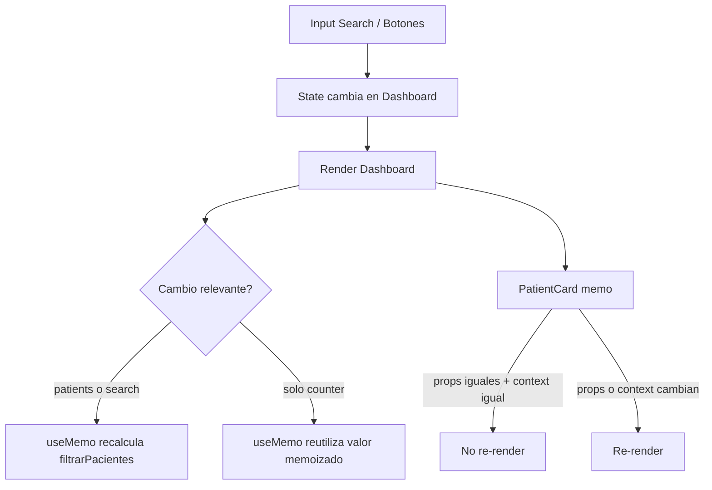

# Fase 2 - Rendimiento y Optimizacion

## Estado de la fase
**Fase 2: Implementada (codigo + documentacion).**

Checklist cumplido:
1. Computo costoso con `filtrarPacientes` y memoizacion via `useMemo`.
2. Referencias estables con `useCallback` y componente memoizado con `React.memo`.
3. Escape hatch con `useRef` para auto-foco y contador de renders.
4. Seccion visual de disparadores de re-render (State / Props / Context).

## 1) Igualdad Referencial (Referential Equality)
**Definicion:** dos variables son referencialmente iguales si apuntan al mismo objeto/funcion en memoria.

```ts
const a = { id: 1 };
const b = a;
const c = { id: 1 };

console.log(a === b); // true (misma referencia)
console.log(a === c); // false (mismo contenido, distinta referencia)
```

### Por que importa en React
- React usa comparaciones por referencia para optimizar renders.
- `React.memo` hace shallow compare de props.
- Si pasas una funcion nueva en cada render, la prop cambia por referencia aunque haga lo mismo.

## 2) `useMemo` vs `useCallback`

| Hook | Memoiza | Caso de uso |
|---|---|---|
| `useMemo` | **valor** resultado de un calculo | evitar recalcular logica pesada |
| `useCallback` | **funcion** (referencia estable) | evitar que props-funcion cambien en cada render |

Regla mental:
- `useMemo`: "quiero guardar el resultado".
- `useCallback`: "quiero guardar la identidad de la funcion".

### Aclaracion clave sobre `useCallback` (caso `handleHydrationBoost`)
- `useCallback` no significa que la funcion "no exista en memoria".
- Significa que React puede devolverte la **misma referencia** entre renders si las dependencias no cambiaron.
- Sin `useCallback`, en cada render del padre se crea una nueva referencia de funcion.
- Con `useCallback` + `React.memo` en el hijo, evitas re-renders innecesarios causados solo por cambio referencial del callback.

## 2.1) Que es `React.memo` y como se aplica aqui
**Definicion simple:** `React.memo` es un \"filtro\" de render para componentes funcionales.

Si las props nuevas son superficialmente iguales a las anteriores, React reutiliza el resultado previo y evita re-render.

### Como se aplica en el codigo
En `PatientCard`:

```ts
const MemoizedPatientCard = memo(PatientCard);
export default MemoizedPatientCard;
```

Esto significa:
1. Cuando `Dashboard` renderiza por cambios no relacionados (ej: `dashboardCounter`), `PatientCard` puede no renderizar si sus props siguen iguales.
2. Para que funcione bien, las props-función deben mantener referencia estable (`useCallback` en `Dashboard`).
3. Si cambia una prop real del paciente (hidratación, status, etc.), esa tarjeta sí se renderiza.
4. Si cambia el Context consumido por `PatientCard`, también se renderiza aunque use `React.memo`.

Regla práctica:
- Usa `React.memo` en componentes que se renderizan mucho o en listas.
- Evítalo si el componente es muy liviano y no hay problema real de performance.

## 3) Flujo implementado en el Dashboard


## 3.1) Props vs State vs Context (sin confusiones)

| Concepto | Que es | Quien lo cambia | A quien impacta | Ejemplo en este proyecto |
|---|---|---|---|---|
| `props` | Datos/callbacks que el padre pasa al hijo | El padre al renderizar | Hijo que recibe esas props | `Dashboard` pasa `onHydrationBoost` y `onDeletePatient` a `PatientCard` |
| `state` | Memoria local del componente | El propio componente (`setState`) | Ese componente (y su arbol) | `search`, `dashboardCounter`, `lastTrigger` en `Dashboard` |
| `context` | Dato compartido por Provider para consumidores | El Provider cambiando `value` | Componentes que usan `useContext` | `PerformanceProvider value={{ contextVersion }}` y consumo en `PatientCard` |

### Aclaraciones clave de tu duda
- `useCallback` no "setea props". Solo estabiliza la referencia de una función en el padre.
- Esa función luego viaja como prop al hijo en JSX.
- `setLastTrigger("context")` **no** provoca un render por Context: solo actualiza state local.
- El render por Context ocurre cuando cambia el `value` del Provider (en este caso, con `setContextVersion(...)`).
- En el botón de "Update context version" se ejecutan dos cosas:
  1. `setContextVersion(...)`: cambio real de Context.
  2. `setLastTrigger("context")`: etiqueta didáctica para mostrar la causa en UI.

## 3.2) `createContext`, `Provider` y `useContext` (simple y directo)
### Analogía simple
Imagina un edificio:
- `createContext`: crea el "canal de comunicación" interno del edificio.
- `Provider`: es la "central" que publica un mensaje para todos los pisos debajo.
- `useContext`: es la "radio" de cada oficina para escuchar ese mensaje.

Si la central cambia el mensaje, todas las oficinas que escuchan la radio reciben actualización.

### ¿Cuál es el fin?
Evitar pasar el mismo dato por muchos niveles con props (`prop drilling`) cuando varias capas lo necesitan.

### ¿Qué se consigue?
1. Compartir datos globales de una rama de UI (tema, usuario, permisos, idioma, etc.).
2. Simplificar wiring entre componentes lejanos.
3. Hacer explícito qué componentes consumen ese dato compartido.

### ¿Para qué se utiliza `useContext`?
Para leer el valor actual del contexto más cercano (el `Provider` superior en el árbol).

### Flujo del proyecto (ejemplo real)
```ts
// 1) Se crea el contexto
const PerformanceContext = createContext<PerformanceContextValue | undefined>(undefined);

// 2) El padre publica un value
<PerformanceProvider value={{ contextVersion }}>
  <PatientCard ... />
</PerformanceProvider>

// 3) El hijo consumidor lo lee
const { contextVersion } = usePerformanceContext();
```

### Cuadro comparativo de las piezas de Context
| Pieza | Función | Dónde se usa aquí |
|---|---|---|
| `createContext` | Define el contenedor del dato compartido | `src/context/PerformanceContext.tsx` |
| `Provider` | Publica `value` a todo el subárbol | `Dashboard` envuelve las `PatientCard` |
| `useContext` | Lee el valor del Provider más cercano | `PatientCard` vía `usePerformanceContext` |

### Regla mental de performance
- Cambiar `state` local: re-render del componente dueño.
- Cambiar `value` del `Provider`: re-render de consumidores de ese contexto.
- `React.memo` ayuda con props, pero no bloquea cambios del contexto consumido.

## 4) Que observar en consola
En `PatientCard` existe:
```ts
console.log(`[render] PatientCard ${patient.id} #${renderCountRef.current}`)
```

### Rol de `lastTrigger` (objetivo pedagógico)
- `lastTrigger` no existe porque React lo necesite para renderizar.
- Es un estado didáctico que usamos para etiquetar la causa del último re-render en la UI.
- Alimenta el panel de `RenderTriggerPanel` para mostrar si el cambio vino de:
  - `state` (ej: `search`, `dashboardCounter`)
  - `props` (ej: actualizar o remover un paciente)
  - `context` (ej: cambiar `contextVersion`)
- Su propósito es ayudarte a entrenar el razonamiento de performance durante la entrevista.

Experimentos:
1. Click en "Increment parent counter":
- Se renderiza el padre.
- Las tarjetas memoizadas **no** deberian volver a renderizar (si props/context no cambiaron).

2. Click en "+5 Hydration" o "Remove":
- Cambian props del/los item(s) afectados.
- Se renderizan solo las tarjetas con props modificadas.

3. Click en "Update context version":
- Cambia Context.
- Se renderizan consumidores de contexto aunque usen `React.memo`.

## 5) Escape hatch con `useRef`
- Auto-foco del buscador al montar (`searchInputRef.current?.focus()`).
- Contador de renders (`dashboardRenderCountRef`) que persiste entre renders sin causar render por si mismo.

## 6) Riesgos y criterio de uso
- No usar memoizacion por defecto en todo: tiene costo cognitivo y comparaciones extra.
- Aplicar cuando hay evidencia: componente pesado, listas grandes, props estables, profiling.

## Preguntas de control + respuesta

### 1) ¿Por qué es una mala idea envolver ABSOLUTAMENTE TODOS los componentes en `React.memo`?
**Respuesta:** porque `React.memo` tambien tiene costo (comparacion de props, complejidad mental y mantenimiento). En componentes baratos o que igual cambian siempre, ese costo puede ser igual o peor que renderizar normalmente.

### 2) ¿En qué escenario específico el uso de `useCallback` sería totalmente inútil o incluso perjudicial?
**Respuesta:** cuando la funcion no se pasa a hijos memoizados ni se usa en dependencias sensibles (por ejemplo, solo se usa localmente en el mismo componente). Ahi solo agrega complejidad y overhead sin beneficio real.
