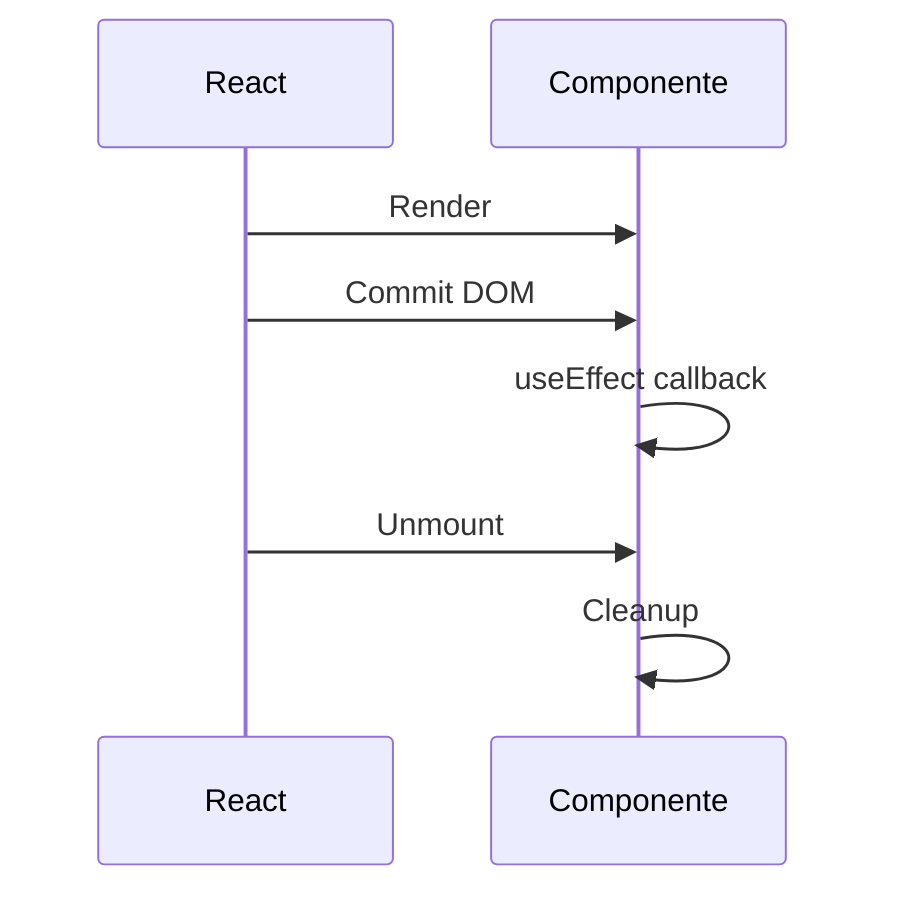

# Phase 1.2 - Hooks criticos (`useState` y `useEffect`)

## 1) `useState`

### Concepto
Permite que un componente funcional tenga memoria entre renders.

### Como funciona
```tsx
const [patients, setPatients] = useState<Patient[]>(() => getInitialPatients())
```
- `patients`: snapshot actual del estado para este render.
- `setPatients`: encola un update.
- `() => getInitialPatients()`: lazy init, solo en mount inicial.

### Batching (React 18)
Múltiples `setState` en el mismo evento suelen agruparse en un solo render.

### Por que estado inmutable
React detecta cambios por referencia (`===`).
- Bien: crear nuevo array/objeto (`map`, spread).
- Mal: mutar el existente (`push`, asignacion directa).

Si mutas, React puede no detectar bien que cambio y rompe predictibilidad.

## 2) `props` vs `state`

| Criterio | Props | State |
|---|---|---|
| Origen | Padre | Componente actual |
| Mutabilidad | Solo lectura | Se actualiza con setter |
| Objetivo | Configurar componente | Guardar memoria local |

Regla mental: **props configuran, state recuerda**.

## 3) `useEffect`

### Concepto
Ejecuta efectos secundarios despues de que React hace commit en el DOM.

### Ejemplo del proyecto
`useMountLogger(scope)`:
- Log en mount.
- Cleanup en unmount.



### Dependencias
- `[]`: corre una vez al montar.
- `[scope]`: corre al montar y cuando `scope` cambia.
- sin array: corre en cada render.

En este proyecto usamos `[scope]` para mantener el logger consistente con el valor actual.
