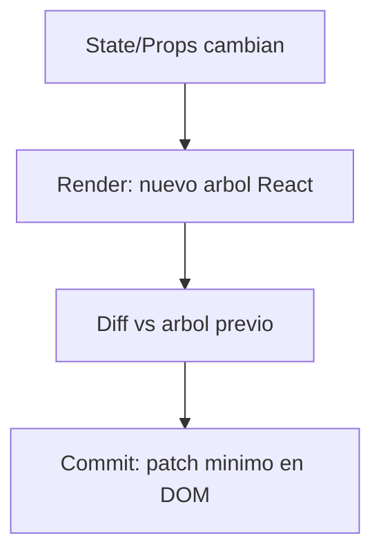

# Phase 1.1 - Runtime de React (JSX, Virtual DOM, Reconciliation)

## 1) JSX
**Concepto:** JSX es azucar sintactica.

```tsx
<PatientCard patient={p} />
```

Se transforma (simplificado) en:
```ts
React.createElement(PatientCard, { patient: p })
```

**Por que importa:** JSX no "pinta" DOM directo. Crea una descripcion (React elements).

## 2) Virtual DOM
**Concepto:** React mantiene una representacion en memoria del arbol UI.

**Como funciona en cada update:**
1. Ejecuta de nuevo la funcion del componente (render phase).
2. Genera nuevo arbol de elementos.
3. Lo compara con el anterior (diff).
4. Aplica cambios minimos al DOM real (commit phase).



## 3) Reconciliation y `key`
**Concepto:** Reconciliation es el algoritmo de diff de React.

En listas, `key` define identidad estable:
- Con `key={patient.id}`, React sabe que tarjeta es cual entre renders.
- Sin key estable, puede reusar nodos incorrectos y mezclar estado local.

## 4) One-way data flow
- `Dashboard` posee el estado fuente (`patients`).
- `PatientCard` recibe datos por `props`.
- `PatientCard` no cambia la lista directo: notifica al padre con callback.

Esto hace el flujo predecible y facil de debuggear.
