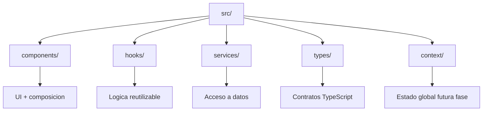

# Phase 1.0 - Stack Foundation (Vite + TS + Tailwind)

## 1) Que es Vite y por que lo usamos
**Concepto:** Vite es un bundler/dev server moderno.

**Como funciona:**
- En desarrollo, no bundlea todo al inicio. Sirve modulos ES bajo demanda.
- Solo transforma el archivo que cambiaste (HMR rapido).
- En build, usa Rollup para generar assets optimizados.

**Por que importa para entrevistas:**
- Explica latencia baja en `pnpm dev`.
- Muestra criterio de DX (developer experience) y performance en tooling.

## 2) Flujo de arranque real del proyecto

- `index.html` solo tiene `

`.
- `main.tsx` monta React en ese nodo.
- `StrictMode` (solo dev) ayuda a detectar efectos inseguros.

## 3) Arquitectura de carpetas

## 4) TypeScript: configuracion clave (`tsconfig.app.json`)
- `strict: true`: evita errores comunes antes de runtime.
- `jsx: react-jsx`: transforma JSX sin importar `React` en cada archivo.
- `noEmit: true`: TS se usa para type-check; Vite hace el build.

## 5) Tailwind en este proyecto
- `tailwind.config.cjs` define donde escanear clases.
- `src/index.css` inyecta `@tailwind base/components/utilities`.
- Las clases utilitarias en JSX se convierten en CSS final solo si se usan.
